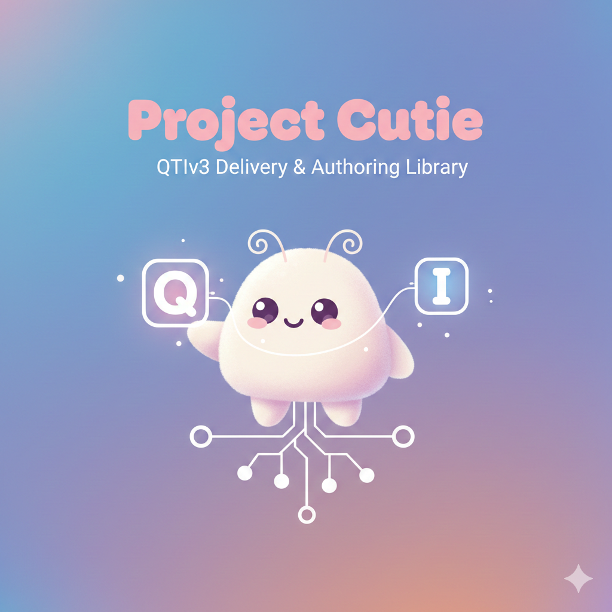

<!-- spell-checker: ignore hotspots -->

# Project Cutie

Project Cutie is an implementation of the QTIv3 standard for displaying and scoring QTI Assessment Items.

## QTI Documentation
- https://www.imsglobal.org/spec/qti/v3p0/impl

## Design

Response and template processing are separated from the presentational layer using purely stateless and asynchronous functions. This allows item definitions to be processed securely in a backend environment without exposing sensitive content to the client.

### Architecture

**Server-side (cutie-core):**
- **Template processing**: Takes item definition and current state, produces sanitized QTI XML
  - Resolves template variables to their current values
  - Applies conditional visibility based on state
  - Strips sensitive content (response processing rules, correct answers, hidden feedback, variable declarations)
  - Returns presentation-ready QTI XML safe for client consumption
- **Response processing**: A reducer function that accepts current state, item definition, and response submission, then produces a new state

**Client-side (cutie-client):**
- Parses sanitized QTI XML from server
- Converts QTI XML to HTML for rendering
- Wires up interaction handlers (drag/drop, drawing, hotspots, etc.)
- Serializes user responses back to QTI format for submission

**Authoring (cutie-editor):**
- React-based WYSIWYG editor for QTI v3 assessment items
- Built with Slate.js for robust editing experience 
- Supports many QTI v3 interaction types, features, and response processing rules
- Text formatting and media embedding
- Strives to be non-destructive to unrecognized elements

**Learner state**: A serializable `AttemptState` object representing a learner's attempt at an item, containing:
- Opaque `variables` object managed by QTI processing (host application doesn't interpret)
- Standardized `completionStatus` field indicating if further attempts are allowed

### Benefits

- **Platform flexibility**: XML intermediate format enables alternative renderers (native mobile apps, PDF generation, accessibility tools)
- **Security**: Server acts as content filter, never exposing sensitive item data
- **Separation of concerns**: Server handles QTI logic, client handles presentation
- **Testability**: Easy to verify server output is valid, sanitized QTI XML

## QTI Extensions

### Feedback Type Attribute (`data-feedback-type`)

QTI uses "feedback" elements (`qti-feedback-block`, `qti-feedback-inline`, `qti-modal-feedback`) for any conditionally-displayed content based on response variables. In practice, this conflates two distinct purposes:

1. **Genuine feedback** - Messages shown to learners about their performance ("Correct!", "Try again", hints)
2. **Conditional content** - Content that changes based on state, especially in adaptive items (problem variations, dynamic instructions)

This distinction matters for delivery: learner feedback benefits from visual treatment (colored borders, emphasis), while conditional content should render as normal prose.

**Solution**: Cutie extends QTI feedback elements with an optional `data-feedback-type` attribute:

| Value | Purpose | Styling |
|-------|---------|---------|
| `correct` | Positive feedback | Green accent |
| `incorrect` | Negative feedback | Red accent |
| `info` | Neutral/informational feedback | Blue accent |
| (none) | Conditional content, not feedback | No special styling |

This attribute is set in `cutie-editor` and preserved through `cutie-core` processing. `cutie-client` applies appropriate styles based on the value.

Items authored without this attribute will render feedback elements unstyled, maintaining backward compatibility with standard QTI content.
