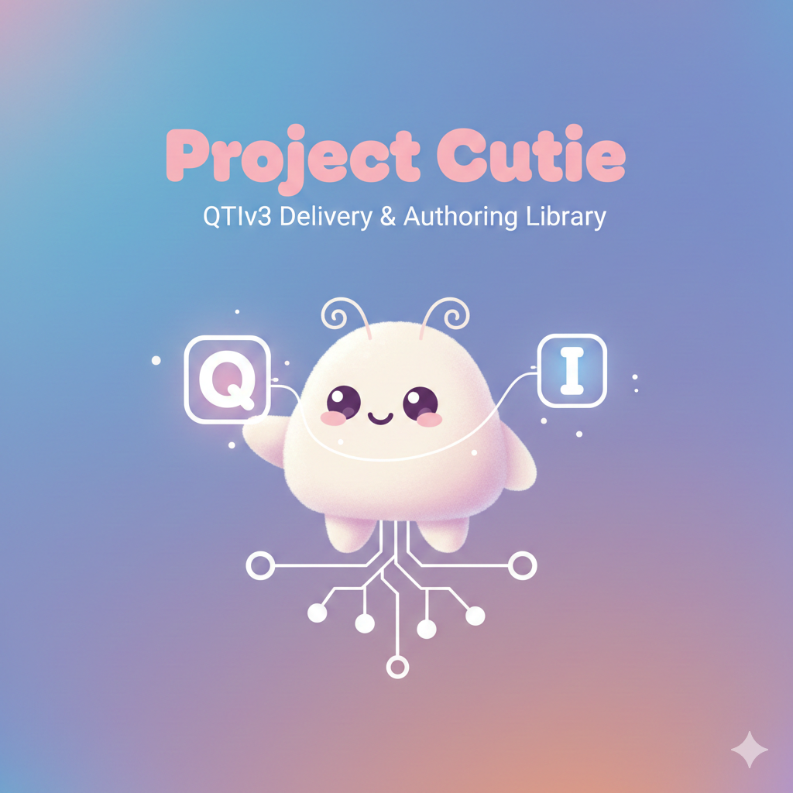

<!-- spell-checker: ignore hotspots -->

# Project Cutie



Project Cutie is an implementation of the QTIv3 standard for displaying and scoring QTI Assessment Items.

## QTI Documentation
- https://www.imsglobal.org/spec/qti/v3p0/impl
- [QTI spec coverage](docs/qti/README.md)

## Design

Response and template processing are separated from the presentational layer using purely stateless and asynchronous functions. This allows item definitions to be processed securely in a backend environment without exposing sensitive content to the client.

### Architecture

**Server-side (cutie-core):**
- **Template processing**: Takes item definition and current state, produces sanitized QTI XML
  - Resolves template variables to their current values
  - Applies conditional visibility based on state
  - Strips sensitive content (response processing rules, correct answers, hidden feedback, variable declarations)
  - Returns presentation-ready QTI XML safe for client consumption
- **Response processing**: A reducer function that accepts current state, item definition, and response submission, then produces a new state

**Client-side (cutie-client):**
- Parses sanitized QTI XML from server
- Converts QTI XML to HTML for rendering
- Wires up interaction handlers (drag/drop, drawing, hotspots, etc.)
- Serializes user responses back to QTI format for submission

**Authoring (cutie-editor):**
- React-based WYSIWYG editor for QTI v3 assessment items
- Built with Slate.js for robust editing experience 
- Supports many QTI v3 interaction types, features, and response processing rules
- Text formatting and media embedding
- Strives to be non-destructive to unrecognized elements

**Learner state**: A serializable `AttemptState` object representing a learner's attempt at an item, containing:
- Opaque `variables` object managed by QTI processing (host application doesn't interpret)
- Standardized `completionStatus` field: `completed` once the attempt is terminal. No further submissions are
  taken, except that a response awaiting manual scoring (`pendingManualScoring`) can still be resubmitted
- `score`, the xAPI-style score of the attempt (the last try's, with [multiple tries](#multiple-tries))
- `options`, the [delivery options](#delivery-extensions) the attempt began under, and the
  [tries](#multiple-tries) counts `triesAllowed`, `triesUsed` and `triesRemaining`
- `correctResponses` and `defaultValues`, the values template processing set with `qti-set-correct-response`
  and `qti-set-default-value`, kept apart from `variables`. They make the attempt its own clone of an item
  template, taking the place of the declared values

### Benefits

- **Platform flexibility**: XML intermediate format enables alternative renderers (native mobile apps, PDF generation, accessibility tools)
- **Security**: Server acts as content filter, never exposing sensitive item data
- **Separation of concerns**: Server handles QTI logic, client handles presentation
- **Testability**: Easy to verify server output is valid, sanitized QTI XML

## QTI Extensions

### Feedback Type Attribute (`data-feedback-type`)

QTI uses "feedback" elements (`qti-feedback-block`, `qti-feedback-inline`, `qti-modal-feedback`) for any conditionally-displayed content based on response variables. In practice, this conflates two distinct purposes:

1. **Genuine feedback** - Messages shown to learners about their performance ("Correct!", "Try again", hints)
2. **Conditional content** - Content that changes based on state, especially in adaptive items (problem variations, dynamic instructions)

This distinction matters for delivery: learner feedback benefits from visual treatment (colored borders, emphasis), while conditional content should render as normal prose.

**Solution**: Cutie extends QTI feedback elements with an optional `data-feedback-type` attribute:

| Value | Purpose | Styling |
|-------|---------|---------|
| `correct` | Positive feedback | Green accent |
| `incorrect` | Negative feedback | Red accent |
| `info` | Neutral/informational feedback | Blue accent |
| (none) | Conditional content, not feedback | No special styling |

This attribute is set in `cutie-editor` and preserved through `cutie-core` processing. `cutie-client` applies appropriate styles based on the value.

Items authored without this attribute will render feedback elements unstyled, maintaining backward compatibility with standard QTI content.

### Formula Response Type (`data-response-type="formula"`)

QTI's standard `qti-extended-text-interaction` treats responses as plain text, comparing strings exactly. For mathematical content, this is problematic: `5x` and `x*5` are mathematically equivalent but fail string comparison.

**Solution**: Cutie extends `qti-response-declaration` with attributes that enable mathematical formula comparison:

```xml
<qti-response-declaration identifier="RESPONSE" cardinality="single" base-type="string"
  data-response-type="formula" data-comparison-mode="algebraic">
  <qti-correct-response>
    <qti-value>x^2-1</qti-value>
  </qti-correct-response>
</qti-response-declaration>
```

**Attributes on `qti-response-declaration`:**

| Attribute | Values | Description |
|-----------|--------|-------------|
| `data-response-type` | `formula` | Enables formula processing for this response |
| `data-comparison-mode` | `strict`, `canonical`, `algebraic` | How to compare expressions (default: `canonical`) |

**Comparison Modes:**

| Mode | Description | Example equivalences |
|------|-------------|---------------------|
| `strict` | AST structure must match exactly after parsing | Only identical LaTeX matches |
| `canonical` | Normalized forms compared | `5x` = `x*5`, `x+y` = `y+x` |
| `algebraic` | Full mathematical equivalence | `2x+3x` = `5x`, `(x+1)(x-1)` = `x^2-1` |

**Client-side rendering**: When `cutie-client` encounters a `qti-extended-text-interaction` linked to a formula response, it renders a [MathLive](https://cortexjs.io/mathlive/) math-field instead of a textarea, providing a rich math editing experience. Falls back to a LaTeX textarea if MathLive fails to load.

**Server-side scoring**: `cutie-core` uses the [Compute Engine](https://cortexjs.io/compute-engine/) to compare LaTeX expressions according to the specified mode when evaluating `qti-match` elements.

Standard QTI items without these attributes continue to work normally with string comparison.

### Character Limits (`data-min-characters`, `data-max-characters`)

QTI's `expected-length` attribute is a sizing hint — it suggests a response length but does
not enforce it. Some assessment scenarios require hard character limits that prevent
submission when constraints are not met.

**Solution**: Cutie extends `qti-extended-text-interaction` with character limit attributes:

```xml
<qti-extended-text-interaction response-identifier="RESPONSE"
  data-min-characters="20" data-max-characters="200" class="qti-counter-up">
```

| Attribute | Element | Description |
|-----------|---------|-------------|
| `data-min-characters` | `qti-extended-text-interaction` | Minimum character requirement; response is invalid when not met |
| `data-max-characters` | `qti-extended-text-interaction` | Hard character limit; response is invalid when exceeded |

`data-max-characters` always displays a live character counter (defaulting to count-down).
The `qti-counter-up` / `qti-counter-down` vocab classes can override the counter direction.
Unlike `expected-length` (which shows "suggested characters"), `data-max-characters` uses
hard-limit language ("characters remaining" / "over limit") and fails validation on submit.

`data-min-characters` displays a constraint message (`"Write at least N characters"`) and
implies the response is required — empty input fails validation without needing `min-strings="1"`.

The two attributes pair well together with `qti-counter-up` to give learners a clear picture
of the acceptable response length range.

## Delivery Extensions

QTI puts delivery controls such as `show-feedback`, `show-solution` and `max-attempts` on
`qti-item-session-control`, at the test level. Cutie is an item-level engine with no test context,
so it takes its own **delivery options** when an attempt begins. They are extensions, not
implementations of those attributes, and a caller passing none gets standard QTI behavior.

### Attempt lifecycle

```typescript
import { beginAttempt, resumeAttempt, setScore, submitResponse } from '@openstax/cutie-core';

// Processing options (e.g. the asset resolver) go to every operation; delivery options only to beginAttempt
const processing = { resolveAssets };

let { state, template } = await beginAttempt(itemXml, processing, { showEvaluation: 'correctness', maxTries: 'smart' });
({ state, template } = await submitResponse(responses, state, itemXml, processing));
({ state, template } = await resumeAttempt(state, itemXml, processing)); // same template, state unchanged
({ state, template } = await setScore(4, 'Good work', state, itemXml, processing)); // for manual scoring
```

Every operation returns an `AttemptResult`:

| Field | Description |
|---|---|
| `state` | The `AttemptState` to persist and pass to the next operation |
| `template` | Sanitized QTI XML for `cutie-client` |
| `hasNewFeedback` | The template shows something the previous one didn't: a feedback element, a verdict, or a correct response. Always `false` from `beginAttempt` and `resumeAttempt`. Hosts use it to decide whether to hold after a submission. |
| `tryConsumed` | The operation ended a try (see [Multiple tries](#multiple-tries)). Only `submitResponse` ends tries. |

- Options are accepted only by `beginAttempt`, recorded with defaults filled in as `state.options`, and fixed
  for the life of the attempt.
- `resumeAttempt` re-renders a state without advancing it: the template is identical to the one the state was
  produced with, and nothing is re-randomized.
- The attempt is **terminal** when `completionStatus === 'completed'`, and `submitResponse` rejects further
  submissions. The exception: until `setScore` clears `pendingManualScoring`, the response can still be
  resubmitted (so hosts shouldn't lock editing on `completionStatus` alone), and evaluation waits.
- Within a try, only an adaptive item (`adaptive="true"` or `"1"`) can leave the attempt `incomplete`, as QTI says; any
  other item's try ends with each submission, whatever its response processing sets. Between tries (see
  [Multiple tries](#multiple-tries)), any item's attempt is `incomplete`.

### Delivery options

| Option | Values | Default | Description |
|---|---|---|---|
| `showFeedback` | `boolean` | `true` | Show feedback that appears when the attempt becomes terminal |
| `showEvaluation` | `'none'`, `'correctness'`, `'correctResponse'` | `'none'` | What the learner is told about how their response was judged, once terminal |
| `shuffleOverride` | `'none'`, `'shuffle'`, `'never'` | `'none'` | Override the item's `shuffle` attributes |
| `maxTries` | positive integer, `'smart'` | `1` | How many tries the learner gets |
| `adaptiveRetryMessage` | `string` | `"That wasn't quite right. Tries remaining: {n}"` | Leads an adaptive item on a fresh try |

Scoring is the same under every option. `maxTries` is the only option that changes the lifecycle.

### Withholding feedback (`showFeedback`)

With `showFeedback: false`, feedback elements (`qti-feedback-block`, `qti-feedback-inline`,
`qti-modal-feedback`) that would appear on the turn the attempt becomes terminal, or later, are removed from
the template. Feedback shown on earlier turns, such as an adaptive item's hints, is untouched. What is withheld
is decided once and stored in `state.withheldFeedback`, so resuming reproduces it. `data-feedback-type` plays
no part.

### Evaluation (`showEvaluation`)

Once the attempt is terminal, cutie-core can tell the client how the response was judged. Each level includes
the one before it:

- **`'correctness'`**: a verdict, `correct`, `incorrect` or `partial`, as `data-cutie-evaluation` on each interaction
  whose response can be judged. It comes from that interaction's response declaration, using the same
  comparisons response processing uses: a mapping with a known maximum (full credit, none, or between), else
  the correct response (a match or not). Verdicts are per interaction, never per choice.
- **`'correctResponse'`**: also a `qti-correct-response` in each response declaration that has one, holding
  this attempt's value (including one set by `qti-set-correct-response`).

The response as a whole also gets a verdict, as `data-cutie-evaluation` on `qti-item-body`: by the score when the
item's maximum is known, otherwise from the verdicts of the interactions the variant shows. It is only
correct when every one of those responses was judged correct.

`cutie-client` draws a verdict as a colored status rail with text or an icon (never color alone), and the
correct response alongside the learner's response, per interaction type. The item-level verdict is announced
to screen readers on renders after the first ("Response is correct"), and each interaction's verdict is read
with it. A verdict clears once the learner edits that response.

### Multiple tries

A **try** ends when response processing completes the item: every submission for a non-adaptive item, or the
submission an adaptive item sets `completionStatus` to `completed` on. A try is not a QTI attempt: QTI's
built-in `numAttempts` counts every submission within a try, restarting with each fresh try, so an adaptive
item's rules (e.g. a hint after the second submission) start over too.

- `triesAllowed` is `maxTries` resolved at `beginAttempt` (`'smart'` replaced by its number), fixed for the
  attempt. `triesUsed` counts the tries that have ended, one per `tryConsumed`. The try in progress is
  `triesUsed + 1`, and once the attempt is terminal `triesUsed` is the try it ended on, so a host can show
  "try 2 of 3" without counting tries itself.
- **Terminal** after a fully correct try, the last try, or a try that awaits manual scoring. `triesRemaining`
  is then `0`. The attempt is `completed`, but while a try awaits manual scoring its response can still be
  resubmitted, which edits that try rather than using another.
- **Fresh try** after a try that falls short (incorrect or partial) with tries left:
  - `completionStatus` is `incomplete`, `triesRemaining` counts down, and `retryVerdict` holds the last try's
    verdict until the fresh try ends. The verdict is drawn until the fresh try's first submission.
  - Outcomes reset to their defaults and `numAttempts` restarts, so the last try's feedback doesn't show.
    Template variables and shuffle orders carry over, so it is the same variant.
  - `score` stays the last try's until the fresh try ends, including through an adaptive item's steps. There
    is no penalty per try.
  - A **non-adaptive** item keeps the learner's responses, with each interaction's verdict and the item's, whatever
    `showEvaluation` says.
  - An **adaptive** item starts over, led by `adaptiveRetryMessage` (`{n}` replaced by the tries remaining),
    which `cutie-client` draws as a feedback block and announces.
- Feedback and evaluation wait for the attempt to be terminal, then follow `showFeedback` and
  `showEvaluation`.
- **`'smart'`** is resolved when the attempt begins. Each guessable interaction allows half the options this
  variant shows (after template conditionals), rounded down, and at least one. The item allows the fewest any
  interaction does:

  | Interaction | Options counted |
  |---|---|
  | choice, order | `qti-simple-choice` |
  | inline choice | `qti-inline-choice` |
  | hotspot | `qti-hotspot-choice` |
  | gap match | `qti-gap-text`, `qti-gap-img` |
  | match | the target set (second `qti-simple-match-set`) |
  | text entry | sets no limit |

  Any other interaction, an externally scored item (`external-scored` by a human or machine), or an item
  nothing limits gets one try.

### Shuffle override (`shuffleOverride`)

- `'none'` follows the item's `shuffle` attributes, as QTI does.
- `'shuffle'` shuffles every interaction that supports shuffling unless it says `shuffle="false"`. This
  departs from QTI, where a missing `shuffle` means no shuffling.
- `'never'` never shuffles.

`fixed` choices keep their position under every value. The order is generated when the attempt begins, stored
in `state.shuffleOrders`, and reused on every turn and on resume.

### Preview (`renderPreview`)

For instructors and authors, `renderPreview` renders an item outside any attempt: the item as an attempt at it
begins, with each interaction's correct response and all of its feedback. QTI has no preview mode, so this is an
extension. There is no state and nothing can be submitted, so mount it read-only:

```typescript
const template = await renderPreview(itemXml, processing, { compact: false });
const item = mountItem(container, template, { interactionState: 'readonly' });
```

- Every `qti-response-declaration` with a correct response gets a `qti-correct-response`, with no verdict.
- Every feedback element is shown, whatever its condition, so feedback that never appears together can appear
  side by side. Modal feedback is shown as block feedback at the end of the item body, rather than as dialogs.
  With `compact: true`, feedback follows the item's initial outcomes, as when an attempt begins.
- An **adaptive** item is always previewed compact: its feedback belongs to the stages of an attempt.
- A `qti-printed-variable` naming an outcome prints as a placeholder (`[SCORE]`), since no response has been
  processed. Template variables take one generated set of values, and choices keep their authored order.

The preview reveals correct responses and all feedback, so it must never reach a learner.

### Template markup added by cutie-core

These appear only in the sanitized template sent to the client. Core removes any authored copy before adding
its own, so the client only ever sees what core computed:

| Markup | Where | When |
|---|---|---|
| `data-cutie-evaluation="correct\|incorrect\|partial"` | interaction elements, `qti-item-body` | terminal under `showEvaluation` `'correctness'` or above; a fresh try of a non-adaptive item |
| `qti-correct-response` | `qti-response-declaration` | terminal under `showEvaluation: 'correctResponse'`; every `renderPreview` |
| `<div data-cutie-retry="incorrect\|partial">` | first child of `qti-item-body` | a fresh try of an adaptive item |
| `data-cutie-preview="true"` | `qti-item-body` | every `renderPreview` |

### Response changes (`onResponseChange`)

`mountItem` accepts an `onResponseChange` callback, called with the current raw responses, before validation, on
every learner edit (including each keystroke), and never when values are restored or re-rendered. It shows no
validation messages. Hosts that want debouncing do it themselves.

### Interaction state (`interactionState`)

What the learner can do with the interactions is one of three states, set with `setInteractionState`, or from the
start with the `interactionState` option of `mountItem` (default `'enabled'`). `update()` keeps the current state.

| State | When | Shown as |
|---|---|---|
| `'enabled'` | the learner is responding | the controls |
| `'disabled'` | for now, as while a submission is pending | the controls, disabled |
| `'readonly'` | the response is final: submitted, under review, or a preview | the controls, disabled; an extended text interaction shows its response as content in place of its input |

A submission that ends the attempt goes `'enabled'` → `'disabled'` while it is pending → `update()` with the new
template → `'readonly'`. With no response, a read-only extended text interaction notes that there is none, or, in a
preview (`data-cutie-preview`), where students will write it.

## Shared Stimulus

A shared stimulus (`qti-assessment-stimulus`) is content kept outside the items that reference it with
`qti-assessment-stimulus-ref`, such as a passage several items ask about. A stimulus declares no variables and has
no processing, so it renders the same for every learner. Where it is shown depends on the item:

- **Docked**: the item body places it, with an element whose `data-stimulus-idref` names the reference. Core
  copies the body of the stimulus into that element, and it renders with the item.
- **Not docked**: QTI leaves placement to the delivery system. The host renders it with `renderStimulus` and
  `mountStimulus`, wherever it likes, possibly once above several items.

```typescript
import { listItemDependencies, renderStimulus } from '@openstax/cutie-core';
import { mountStimulus } from '@openstax/cutie-client';

// Everything external the item references, for the host to resolve
const { assets, stimuli } = listItemDependencies(itemXml);
// stimuli: [{ identifier: 'Stimulus1', href: 'passages/night.xml', title: 'Night', docked: false }]

// Docked stimuli: resolved in batch, returning each stimulus's XML in order
const processing = { resolveAssets, resolveStimuli: async (refs) => refs.map((ref) => loadXml(ref.href)) };
const { state, template } = await beginAttempt(itemXml, processing);

// Stimuli that are not docked: the host places them
const stimulus = await renderStimulus(stimulusXml, { resolveAssets });
mountStimulus(container, stimulus);
```

- Rendering an item that docks a stimulus requires `resolveStimuli`. It throws without one, when the resolver
  returns nothing for a stimulus, or when a dock names a stimulus the item doesn't reference: the item can't be
  shown as authored. Only docked stimuli are passed to the resolver, and only docks a template shows.
- Asset URLs are passed to `resolveAssets` as authored, so a relative URL is relative to the document it appears
  in. Each request names that document: `{ url, base? }`, where `base` is the href the rendered document
  references it by (a docked stimulus's `href`), and is missing for the rendered document's own assets. An item's
  assets and those of the stimuli it docks are resolved in one batch.
- For `renderStimulus`, the stimulus is the rendered document, so its assets arrive with no `base`: the resolver
  passed to it must resolve relative to the stimulus. A missing `base` means the rendered document, not the item.
- `listItemDependencies` and `listStimulusDependencies` each list only their own document's references, relative
  to it. To inventory an item's assets with its stimuli's, pair each stimulus asset with the stimulus's `href` as
  its `base`:

  ```typescript
  const { assets, stimuli } = listItemDependencies(itemXml);
  const inventory = [
    ...assets.map((url) => ({ url })),
    ...(await Promise.all(stimuli.map(async (ref) =>
      listStimulusDependencies(await loadXml(ref.href)).assets.map((url) => ({ url, base: ref.href }))
    ))).flat(),
  ];
  ```
- HTML `id`s pass through unchanged. QTI expects authoring systems to keep them unique across an item and its
  stimuli.
- Known gaps: the stimulus's `qti-stylesheet` is not applied (no stylesheets are), and its `qti-catalog-info` is
  not supported (no catalogs are).
